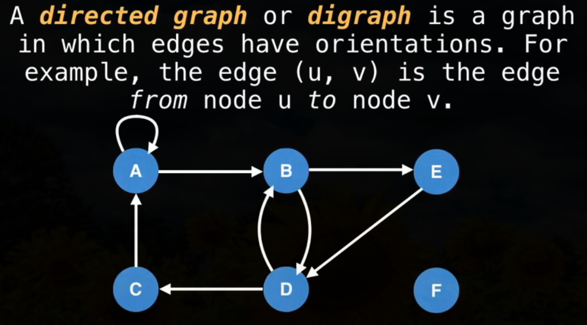
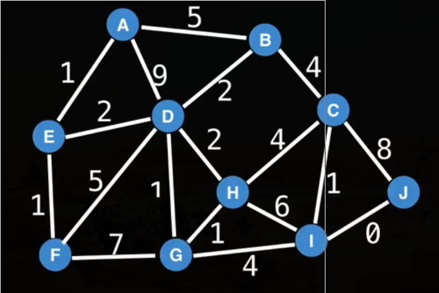
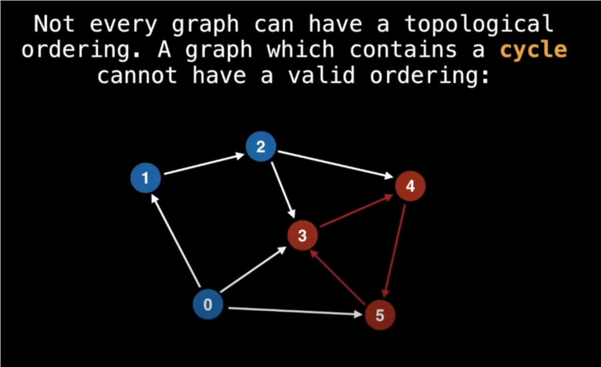
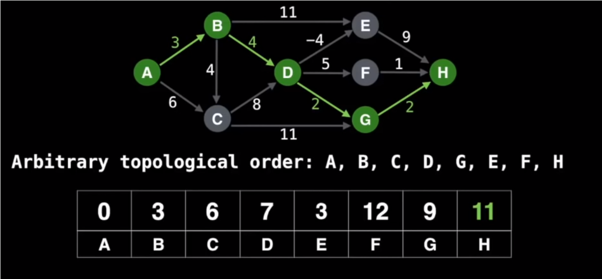

# Graph types

### Undirected graph

### Directed graphs / Digraphs

### Weighted graphs

### Tree

### Rooted tree

### Directed Acyclic Graphs

- scheduler, compiler, build system
- shortest paths algorithm
- topological ordering: how to process the nodes of graph so I don't perform a task before having complete all it's dependencies

### Bipartite graph

- often question to ask is "what is maximum matching on bipartite graph"
- "how many people can be matched to jobs"
- tougher constrains, more conflicts
- play critical role in field of network flow

### Complete graph

- worst case of graph, because of number of the edges.
- good place for start of testing algorithm efficiency.

# Representing graphs

### Adjacency matrix

### Adjacency matrix

- each node tracks all it's edges
  
  

### Edge list

# Common problems and solutions

### Shortest path

- algorithms: BFS, Dijkstra's, Bellman-Ford. Floyd-Warshall, A\*,

### Connectivity

- typical solution: union find data structure, or any search algorithm (DFS)

### Negative cycles in directed graph

- algorithms: Bellman-Ford, Floyd-Warshall
- in a context of finding shortest path, negative cycle is sort of a trap that can never be escaped
- good for detecting arbitrage: cycling trough currencies to get more money

### Strongly connected components

- algorithms: Tarjan's and Kosaraju

### Traveling salesman problem

- NP problem
- several important applications
- algorithms: Held-Karp, branch and bound, ant colony optimization

### Bridges

### Articulation points

### Minimum spanning tree

- algorithms: Kruskal, Prim, Boruvka
- applications: circuit design, transportation networks, designing least cost network

### Max flow trough flow network

- algorithms: Ford-Fulkerson, Edmonds-Karp, Dinic's

# Algorithms

### DFS

- compute a graphs minimum spanning tree
- detect and find cycles in a graph
- check if a graph is bipartite
- find strongly connected components
- topologically sort the nodes of a graph
- find bridghes and articulation points
- find augmenting paths in a flow network
- generate mazes

### BFS

### Topological Sort

- the only type of graph which has a valid topological ordering is a Directed Acyclic Graph.
- situations that can be modelled as graph with directed edges, where some events must occur before others: school class prerequisites, program dependencies, event scheduling, assembly instuctions

##### how to

1. find unvisited nodes **A**
2. do DFS from **A** to unvisited nodes
3. on backtrack, add **A** to the end of a topsort list

### Shortest and longest path on Directed Acyclic Graphs

- SSSP - single source shortest path can be solved in O(V+E) with topsort
- relaxing a edge obeding to better value if shortest path can be obtained using current edge
- for longest path multiply all edges with -1, find shortest path, multiply answer by -1

### Dijkstra

-
